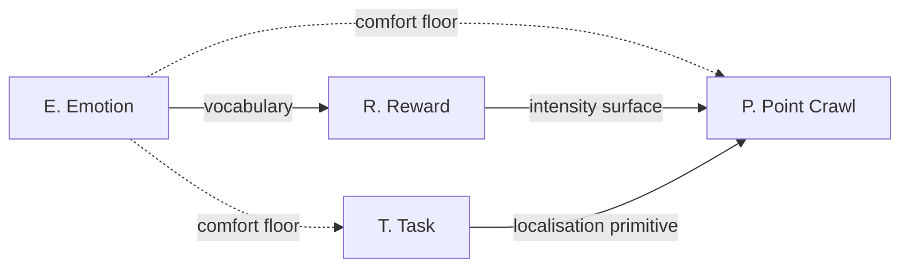
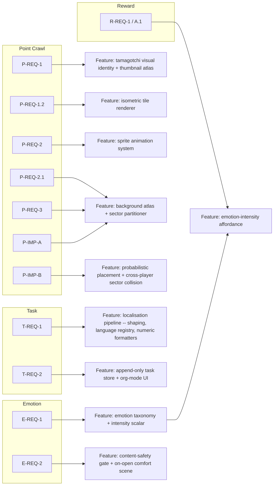
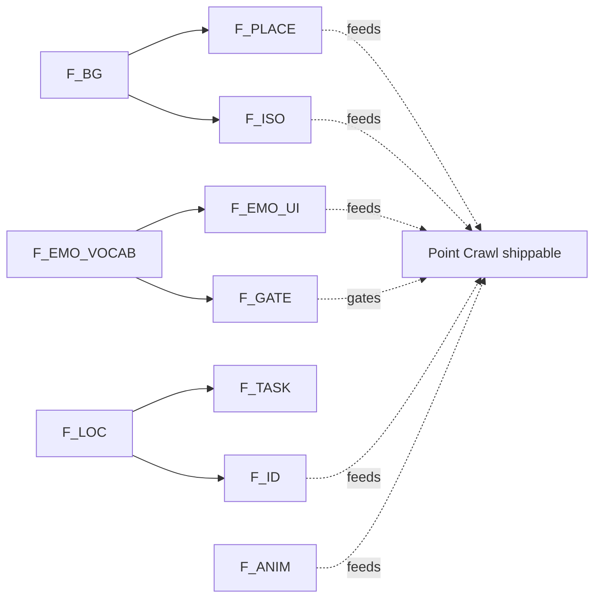

# MVP — KYIV Requirements vs. Feature Wishlist

Source: handwritten scoping page, 2026-05-24.
Scope: the five red-bordered subsystems on the page. The pencilled
top-left brainstorm (morph/Tokens/Control Flash/boat-ski sketch) was
not red-bordered and is excluded.

KYIV is the prioritization methodology applied here:

- **K — Key.** Must ship in MVP. Cut anything else before cutting these.
- **Y — Yes.** Wanted, deferred past MVP. No work in MVP, but the
  data model and architecture should not preclude them.
- **I — Irrelevant.** Considered briefly and dropped — not interesting
  enough to spend planning cycles on.
- **V — Vetoed.** Considered and explicitly rejected. Cite the veto
  when the question recurs.

Conventions for IDs:

- `REQ` — a requirement statement (bucket K or Y).
- `IMP` — an implementation directive attached to a requirement.
- `WISH` — the page's own marker for Y-bucket items.
- IDs are stable; later devlog entries may reference them.

---

## A. KYIV classification

### A.K — Key

| ID | Subsystem | Statement |
|---|---|---|
| `P-REQ-1`   | Point Crawl | Distinguishable thumbnail icon per tamagotchi in the point-crawl view. |
| `P-REQ-1.2` | Point Crawl | Point-crawl rendered as an isometric "adventure map." |
| `P-REQ-2`   | Point Crawl | Up-close dwelling animation per tamagotchi. |
| `P-REQ-2.1` | Point Crawl | Up-close dwelling backgrounds (asset class distinct from animations). |
| `P-REQ-3`   | Point Crawl | Up-close destination backgrounds, distinct from dwelling backgrounds. |
| `P-IMP-A`   | Point Crawl | Backgrounds authored as top-down landscapes, partitioned into per-sector regions. |
| `P-IMP-B`   | Point Crawl | Probabilistic point grid for dwelling placement; intra-network co-sector tamagotchis render as neighbours; collision rate ≈ 0 at Dunbar Layer 2 (~15). |
| `R-REQ-1`   | Reward | Intensity of the in-scope reward category shall be elegantly conveyed. |
| `R-IMP-A.1` | Reward | In-scope reward category: tamagotchi's emotional response toward its paired human. |
| `E-REQ-1`   | Emotion | Emotion vocabulary of sufficient breadth to satisfy dependent subsystems, notably `R-REQ-1`. |
| `E-REQ-2`   | Emotion | No directly negative emotional content; on-open experience is a guaranteed-comfort floor. |
| `T-REQ-1`   | Task | Localisation: bidirectional + vertical text (LTR/RTL/TTB), multiple natural languages, multiple numeric systems. |
| `T-REQ-2`   | Task | Daily-task tracking with an org-mode-equivalent interaction model. |

### A.Y — Yes (deferred past MVP)

| ID | Subsystem | Statement |
|---|---|---|
| `P-WISH-C`  | Point Crawl | Hidden ("secret") destination backgrounds. |
| `P-WISH-D`  | Point Crawl | Mode-of-transportation mechanism over the point-crawl graph. |
| `R-IMP-A.2` | Reward | Resource accrual as a reward category. |
| `R-IMP-A.3` | Reward | Human-selected items / experiences / abilities granted to the tamagotchi (e.g., bicycle for faster adventures). |
| `T-WISH-A`  | Task | Spaced-repetition scheduling layered over `T-REQ-2`. |

### A.I — Irrelevant

None enumerated in this scoping pass. The pencilled brainstorm
(morph/Tokens, Control Flash, Fairies, Artifacts, Sacrificial
Reanimator, Gob. morph channel, boat/ski sketch) sits *upstream* of
KYIV — it has not been promoted to a candidate, so it is not yet
classified.

### A.V — Vetoed

| ID | Subsystem | Statement | Veto reason |
|---|---|---|---|
| `S5-VETO` | Reflection | The entire Reflection subsystem is out of scope for MVP. | Marked "Out of scope" on the source page. |
| `E-VETO-NEG` | Emotion | Directly negative emotional content is prohibited. | Active veto by `E-REQ-2`; cite when re-litigating tone. |

---

## B. Per-subsystem statements

Verbose form of the rows above, retained because future devlog
entries will quote requirement text, not table cells.

### B.1 Point Crawl Subsystem (`P`)

- **P-REQ-1** [K]. The system shall render a distinguishable
  thumbnail icon for each tamagotchi within the point-crawl view.
- **P-REQ-1.2** [K]. The point-crawl view shall be presented as an
  isometric "adventure map" rather than a top-down or schematic graph.
- **P-REQ-2** [K]. The system shall render an up-close dwelling
  animation for each tamagotchi.
- **P-REQ-2.1** [K]. The system shall provide up-close dwelling
  *backgrounds* as a distinct asset class from dwelling animations.
- **P-REQ-3** [K]. The system shall provide up-close destination
  backgrounds, distinct from dwelling backgrounds.
- **P-IMP-A** [K]. Backgrounds shall be authored as top-down
  landscapes and partitioned into per-sector regions consumable by
  the renderer.
- **P-IMP-B** [K]. Tamagotchi home dwellings shall be placed on a
  probabilistic point grid. Two tamagotchis belonging to the same
  player's social network that fall into the same sector shall be
  rendered as neighbours. The expected rate of such collisions is
  negligible given a Dunbar Layer-2 network size of ~15.
- **P-WISH-C** [Y]. Hidden ("secret") destination backgrounds,
  surfaced under conditions to be defined.
- **P-WISH-D** [Y]. A mode-of-transportation mechanism layered over
  the point-crawl graph.

### B.2 Reward Subsystem (`R`)

- **R-IMP-A** [K]. The reward space is partitioned into three
  categories:
  - **A.1** [K]: Tamagotchi emotional response toward its paired human.
  - **A.2** [Y]: Resource accrual.
  - **A.3** [Y]: Human-selected items, experiences, or abilities
    granted to the tamagotchi.
- **R-REQ-1** [K]. The system shall elegantly convey to the user the
  intensity of the in-scope reward category (`A.1`).
- **R-SCOPE** [K]. Only `A.1` is in scope for MVP; the architecture
  must not preclude `A.2` / `A.3` being added later.

### B.3 Emotion Subsystem (`E`)

- **E-REQ-1** [K]. The system shall define an emotion vocabulary of
  sufficient breadth to satisfy all dependent subsystems, notably
  `R-REQ-1`.
- **E-REQ-2** [K]. The system shall surface no directly negative
  emotional content. The on-open experience shall constitute a
  guaranteed-comfort floor.

### B.4 Task Subsystem (`T`)

- **T-REQ-1** [K]. The system shall support localisation: LTR / RTL /
  TTB typography, multiple natural languages, multiple numeric
  systems.
- **T-REQ-2** [K]. The system shall provide daily-task tracking with
  an org-mode-equivalent interaction model.
- **T-WISH-A** [Y]. Spaced-repetition scheduling layered over
  `T-REQ-2`.

### B.5 Reflection Subsystem

- **`S5-VETO`** [V]. Entire subsystem out of scope for MVP.

---

## C. Dependencies

### C.1 Subsystem-level dependencies

`E` is the upstream gate: nothing renders user-facing affect until
`E-REQ-1` defines a vocabulary and `E-REQ-2` constrains its surface.
`R-REQ-1`'s "intensity" reading is itself surfaced inside the
point-crawl view (`P`), so `R` feeds `P` even though `R` has no
standalone screen. `T`'s localisation work is the first place the
project must ship multi-script typography, which `P`'s on-screen
labels then reuse.

### C.2 Requirements → spawned engineering features

### C.3 Critical path

Two roots dominate: **emotion vocabulary** (`F_EMO_VOCAB`) and
**background atlas + sectoring** (`F_BG`). Localisation
(`F_LOC`) is a third independent root that gates anything carrying
text, including thumbnail labels under `P-REQ-1`.

---

## D. Open questions raised by transcription

1. `T-REQ-1`: the page reads "BTL, TTB(?)". Read here as
   "bidirectional + vertical text (LTR/RTL/TTB)"; confirm whether a
   specific script motivated the note.
2. `P-IMP-B`: "Dunbar Layer 2 (~15)" — confirm whether the per-sector
   collision budget is the Dunbar-15 cohort or a tighter close-tie
   subset.
3. `R-SCOPE`: confirm whether deferring `A.2 / A.3` to Y also defers
   their data-model footprints, or whether stubs should land in MVP
   to avoid schema migration later.
