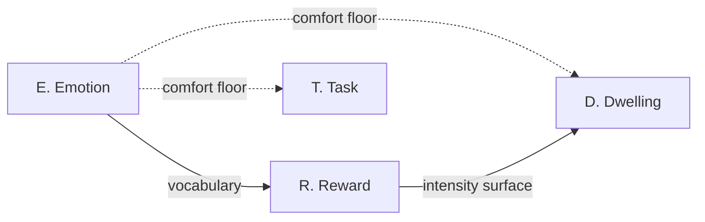

# MVP — KYIV Scoping (Tighter Pass)

Supersedes [`00-…`](00-mvp-kyiv-requirements-vs-feature_wishlist.md)
for MVP-shipping decisions. Source-of-truth requirement *text* and
IDs remain in `00-…`; this doc reclassifies them.

Contraction from `00-…`:

- Point Crawl subsystem vetoed in full.
- New `D` (Dwelling) subsystem carved out of `P`, retaining the two
  dwelling items only.
- Tamagotchi confined to its own dwelling for the first few versions.
  No map, no neighbours, no destinations.

---

## A. KYIV (tighter)

### A.K — Key

| ID | Subsystem | Statement |
|---|---|---|
| `D-REQ-1` | Dwelling | Up-close dwelling animation (was [`P-REQ-2`](00-mvp-kyiv-requirements-vs-feature_wishlist.md#p-req-2)). |
| `D-REQ-2` | Dwelling | Up-close dwelling background (was [`P-REQ-2.1`](00-mvp-kyiv-requirements-vs-feature_wishlist.md#p-req-2-1)). |
| [`R-REQ-1`](00-mvp-kyiv-requirements-vs-feature_wishlist.md#r-req-1)     | Reward   | Elegant conveyance of in-scope reward intensity. |
| [`R-IMP-A.1`](00-mvp-kyiv-requirements-vs-feature_wishlist.md#r-imp-a-1) | Reward   | In-scope reward category: tamagotchi's affection toward its paired human. |
| [`E-REQ-1`](00-mvp-kyiv-requirements-vs-feature_wishlist.md#e-req-1)     | Emotion  | Emotion vocabulary sufficient for `R-REQ-1`. |
| [`E-REQ-2`](00-mvp-kyiv-requirements-vs-feature_wishlist.md#e-req-2)     | Emotion  | No directly negative content; on-open is the guaranteed-comfort floor. |
| [`T-REQ-1`](00-mvp-kyiv-requirements-vs-feature_wishlist.md#t-req-1)     | Task     | Localisation: LTR / RTL / TTB, multiple natural languages and numeric systems. |
| [`T-REQ-2`](00-mvp-kyiv-requirements-vs-feature_wishlist.md#t-req-2)     | Task     | Daily-task tracking with org-mode-equivalent interaction. |

### A.Y — Yes (deferred past tighter MVP)

| ID | Statement |
|---|---|
| [`R-IMP-A.2`](00-mvp-kyiv-requirements-vs-feature_wishlist.md#r-imp-a-2) | Resource-accrual reward category. |
| [`R-IMP-A.3`](00-mvp-kyiv-requirements-vs-feature_wishlist.md#r-imp-a-3) | Human-granted items / experiences / abilities. |
| [`T-WISH-A`](00-mvp-kyiv-requirements-vs-feature_wishlist.md#t-wish-a)   | Spaced-repetition scheduling over `T-REQ-2`. |

Point-crawl wishlist items
([`P-WISH-C`](00-mvp-kyiv-requirements-vs-feature_wishlist.md#p-wish-c),
[`P-WISH-D`](00-mvp-kyiv-requirements-vs-feature_wishlist.md#p-wish-d))
are vetoed with their parent subsystem, not held in Y.

### A.I — Irrelevant

None enumerated this pass.

### A.V — Vetoed

| ID | Statement | Reason |
|---|---|---|
| `S1-VETO` | Entire Point Crawl subsystem: [`P-REQ-1`](00-mvp-kyiv-requirements-vs-feature_wishlist.md#p-req-1), [`P-REQ-1.2`](00-mvp-kyiv-requirements-vs-feature_wishlist.md#p-req-1-2), [`P-REQ-3`](00-mvp-kyiv-requirements-vs-feature_wishlist.md#p-req-3), [`P-IMP-A`](00-mvp-kyiv-requirements-vs-feature_wishlist.md#p-imp-a), [`P-IMP-B`](00-mvp-kyiv-requirements-vs-feature_wishlist.md#p-imp-b), [`P-WISH-C`](00-mvp-kyiv-requirements-vs-feature_wishlist.md#p-wish-c), [`P-WISH-D`](00-mvp-kyiv-requirements-vs-feature_wishlist.md#p-wish-d). | No map / no cross-player visibility / no destinations in tighter MVP. Revisit no earlier than version 3. |
| [`S5-VETO`](00-mvp-kyiv-requirements-vs-feature_wishlist.md#s5-veto)         | Reflection subsystem. | Marked "Out of scope" on source page. |
| [`E-VETO-NEG`](00-mvp-kyiv-requirements-vs-feature_wishlist.md#e-veto-neg) | Directly negative emotional content. | Active veto by `E-REQ-2`. |

---

## B. Delta from `00-…`

| ID | Was | Is | Reason |
|---|---|---|---|
| [`P-REQ-2`](00-mvp-kyiv-requirements-vs-feature_wishlist.md#p-req-2)     | K | K → renamed [`D-REQ-1`](#d-req-1) | Detach from vetoed subsystem. |
| [`P-REQ-2.1`](00-mvp-kyiv-requirements-vs-feature_wishlist.md#p-req-2-1) | K | K → renamed [`D-REQ-2`](#d-req-2) | Same. |
| [`P-REQ-1`](00-mvp-kyiv-requirements-vs-feature_wishlist.md#p-req-1)     | K | V | No map → no thumbnails. |
| [`P-REQ-1.2`](00-mvp-kyiv-requirements-vs-feature_wishlist.md#p-req-1-2) | K | V | No map → no isometric grid. |
| [`P-REQ-3`](00-mvp-kyiv-requirements-vs-feature_wishlist.md#p-req-3)     | K | V | No traversal → no destinations. |
| [`P-IMP-A`](00-mvp-kyiv-requirements-vs-feature_wishlist.md#p-imp-a)     | K | V | Sector partitioning is map-renderer scaffolding. |
| [`P-IMP-B`](00-mvp-kyiv-requirements-vs-feature_wishlist.md#p-imp-b)     | K | V | Probabilistic placement is meaningless without cross-network visibility. |
| [`P-WISH-C`](00-mvp-kyiv-requirements-vs-feature_wishlist.md#p-wish-c)   | Y | V | Falls with parent. |
| [`P-WISH-D`](00-mvp-kyiv-requirements-vs-feature_wishlist.md#p-wish-d)   | Y | V | Falls with parent. |

All other rows from `00-…` unchanged.

---

## C. Dependencies (tighter)

Roots: `E-REQ-1` (emotion vocabulary), `D-REQ-2` (dwelling
background). `T-REQ-1` localisation is now wholly internal to T;
there are no map labels or thumbnail captions consuming it.

---

## D. Open questions

Inherited from `00-…`:

1. [`T-REQ-1`](00-mvp-kyiv-requirements-vs-feature_wishlist.md#t-req-1)
   direction-set confirmation (LTR / RTL / TTB).
2. [`R-SCOPE`](00-mvp-kyiv-requirements-vs-feature_wishlist.md#r-scope)
   data-model footprint for A.2 / A.3 stubs.

Resolved by [`S1-VETO`](#s1-veto):

- [`P-IMP-B`](00-mvp-kyiv-requirements-vs-feature_wishlist.md#p-imp-b)
  Dunbar-cohort sizing question is moot.
